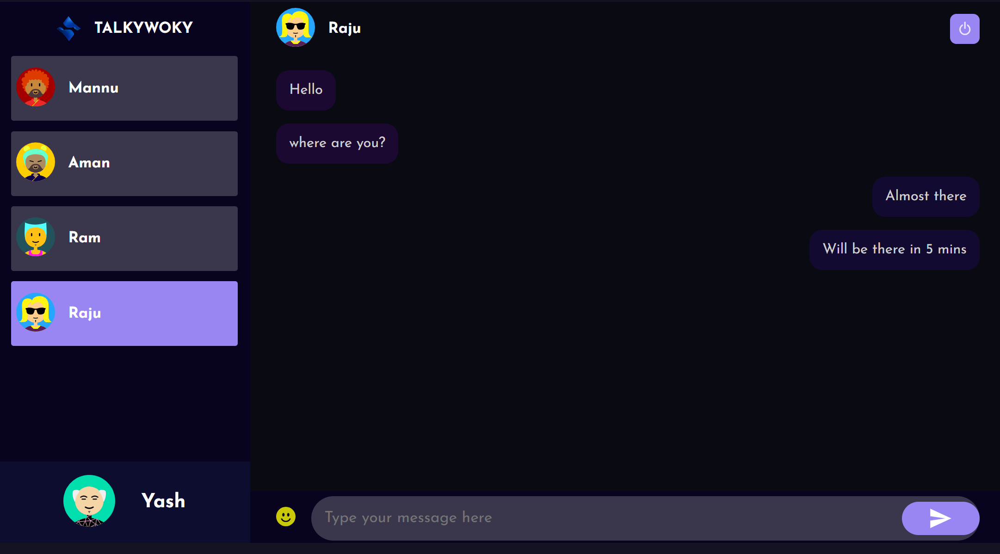

# Chat Application

This project is a simple chat application built using the MERN stack (MongoDB, Express.js, React.js, Node.js) and Socket.IO for real-time communication.

## Features

- **Login and Registration**: Users can create accounts and log in securely.
- **Real-time Chat**: Chat with other users in real-time using Socket.IO.
- **Responsive Design**: User interface is designed to work seamlessly across devices.

## Screenshots

### Login Page


### Register Page


### Chat Page

## User 1



## User 2


## Installation

To run this project locally, follow these steps:

1. Clone the repository using the following command:

```bash
git clone https://github.com/mannubhai1/TalkyWoky
```

2. Install dependencies:

```bash
npm install
```

3. Start the development server:

```bash
npm start
```

4. Open your browser and navigate to `http://localhost:3000` to view the application.

## Technologies Used

- **Frontend**: React.js
- **Backend**: Node.js, Express.js
- **Database**: MongoDB
- **Real-time Communication**: socket.io

## Contributing

Contributions are welcome! Please fork the repository and create a pull request with your proposed features, bug fixes, or enhancements.
